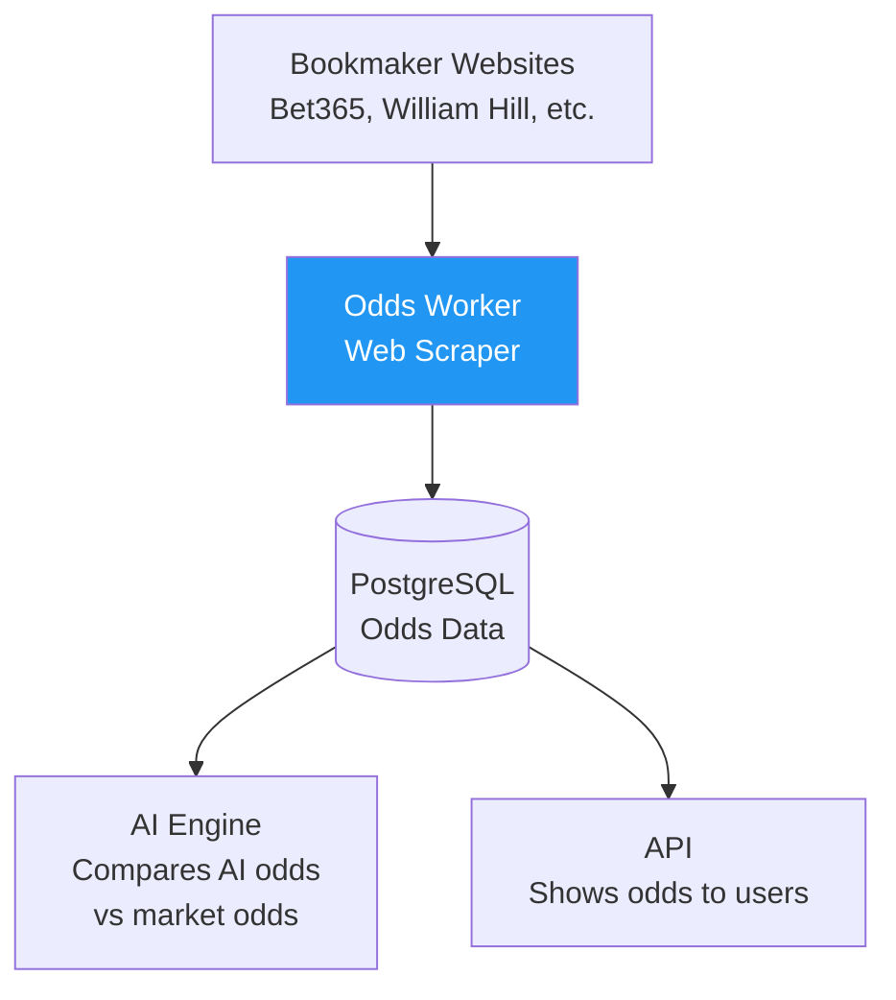

# 🎯 DarkHorses-Odds-Workers - The Idiot's Guide

> **TL;DR:** Python worker that scrapes current betting odds from bookmakers and tracks how they change over time

---

## 🤔 What Is This?

**In Plain English:** DarkHorses-Odds-Workers is a background service that continuously collects betting odds from various bookmaker websites. It scrapes odds every 2 minutes and stores them in the database so the AI can see which horses the "market" (other bettors) thinks will win.

**Real-World Analogy:**
> 💡 Think of it like a **stock market ticker** - it constantly monitors prices (odds) across different exchanges (bookmakers), tracking how odds move up and down as race time approaches. Big odds changes signal important information.

---

## 🎯 Why Does It Matter?

### The Problem
> **❌ Problem:** Betting odds contain valuable information about race outcomes. The "wisdom of the crowd" is often surprisingly accurate. Without odds data, your AI misses what thousands of expert bettors think.

### The Solution
> **✅ Solution:** This worker continuously scrapes odds from multiple bookmakers, tracks odds movement, and identifies value bets (where your AI prediction differs significantly from market odds).

---

## 🔄 How It Fits In The Ecosystem



**Data Flow:**
- 📥 **Gets data from:** Bookmaker websites (via web scraping or APIs where available)
- ⚙️ **Processes:** Extracts odds, normalizes formats, calculates implied probabilities
- 📤 **Sends data to:** PostgreSQL database (odds_data table with timestamps)

---

## 📚 Key Concepts (In Plain English)

### 1. What This Project Does
A **Python web scraping worker** that:
- **Scrapes bookmaker sites:** Visits betting websites and extracts current odds
- **Normalizes data:** Converts fractional odds (5/1) to decimal (6.0) and probabilities (16.7%)
- **Tracks changes:** Stores odds with timestamps to see how they move
- **Identifies value:** Compares market odds with AI predictions

### 2. When It Runs
**Runs continuously 24/7** - deployed as a background service. Wakes up every 2 minutes (more frequent than weather because odds change rapidly), scrapes data, stores it, and sleeps.

### 3. Why It Matters
Odds tell you **what the market thinks**:
- **Odds shortening** (getting lower) = more people betting on that horse = market confidence
- **Odds drifting** (getting higher) = fewer bets = market losing confidence
- **Value bets:** If AI says 60% but odds say 30%, that's a great opportunity

---

## ⚙️ What Happens When It Runs?

**Simple 3-Step Flow:**

1. **Check upcoming races:** Query database for races in next 6 hours
2. **Scrape bookmakers:** For each race → Visit bookmaker websites → Extract odds for all horses
3. **Store with timestamp:** Save odds to database with time → Enables trend analysis

**Real Example:**
> 💡 It's 1:00pm and there's a race at Ascot at 2:00pm with 12 horses:
>
> 1. Worker wakes up → Finds "Ascot 2pm race" in database
> 2. Visits Bet365 website → Scrapes: `Horse #3 "Lightning Bolt" = 2/1 (33% implied)`
> 3. Visits William Hill → Scrapes: `Horse #3 = 9/4 (31% implied)`
> 4. Stores in database:
>    ```
>    race_id: 123, horse: 3, bookie: "Bet365", odds: 2.0, time: 13:00
>    race_id: 123, horse: 3, bookie: "WHill", odds: 2.25, time: 13:00
>    ```
> 5. At 1:30pm AI sees: Market average says 32% chance to win
> 6. Goes back to sleep for 2 minutes

---

## 🚀 When Would You Use This?

**You should run this when:**
- ✅ You need real-time betting odds for predictions
- ✅ You want to identify value bets (AI vs market disagreement)
- ✅ You're running the full DarkHorses system in production
- ✅ You want to track market sentiment and odds movement

**You DON'T need this if:**
- ❌ You're training AI models with historical data only
- ❌ You don't have permission to scrape bookmaker sites (legal concerns)
- ❌ You're running a demo/sandbox without live betting
- ❌ Your AI doesn't use market odds as a feature

---

## 🔗 Dependencies

**This project needs:**
- **Web scraping tools** - Selenium, BeautifulSoup, or Playwright
- **Bookmaker access** - ability to access betting websites (check ToS!)
- **PostgreSQL Database** - stores odds data
- **Python 3.10+** - runtime environment
- **APScheduler or Celery** - schedules the 2-minute interval
- **Proxy rotation** - to avoid IP bans from bookmakers

**Other projects that depend on this:**
- **DarkHorses-AI-Engine** - uses odds as a key prediction feature
- **DarkHorses-API** - serves odds data to frontend for display
- **Value bet detector** - finds opportunities where AI disagrees with market
- **Analytics** - historical odds data for model training
